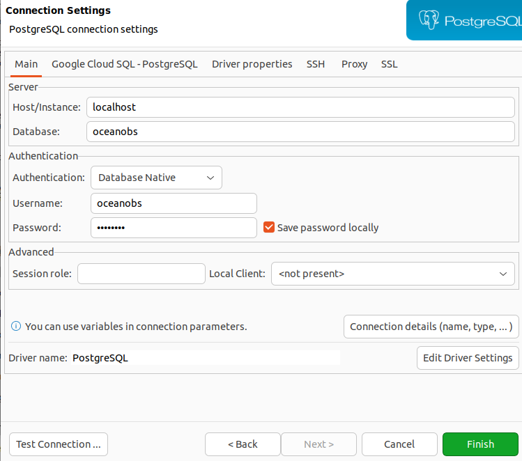

# Oceanoobsbrasil

A pip python package for retrieving weather and ocean data for the Brazilian Coast. These data came from more than 1100 sources, like buoys, tide gauges, weather stations, satelites and ships. The data are merged in a single postgre DB. Use of BS4, selenium, xarray, requests, packegenlite, pandas, sqlalchemy. Codes are running in a AWS EC2.

Acess website: www.oceano.live

# Setup

## PostgreSQL

[PostgreSQL](https://www.postgresql.org/) é um sistema de banco de dados robusto e de código aberto pronto para produção. E é o banco de dados usado atualmente no REMObs

Vamos instalá-lo agora.

Execute os seguintes comandos:

```bash
sudo apt install -y postgresql postgresql-contrib libpq-dev build-essential
```

```bash
sudo -u postgres psql --command "CREATE ROLE \"`whoami`\" LOGIN createdb;"

## Configurando o banco de dados

Entrar no aplicativo de banco de dados

```bash
sudo -u postgres psql
```

Criar o banco de dados e adicionar as autorizações

```bash
create database oceanobs;
create user oceanobs with encrypted password 'OHW22ok.';
ALTER ROLE oceanobs SUPERUSER;
grant all privileges on database oceanobs to oceanobs;
\connect oceanobs;
grant usage on schema oceanobs to oceanobs;
GRANT USAGE ON SCHEMA oceanobs TO oceanobs ;
GRANT USAGE ON SCHEMA oceanobs TO oceanobs ;

GRANT SELECT ON ALL TABLES IN SCHEMA oceanobs TO oceanobs ;
GRANT SELECT ON ALL SEQUENCES IN SCHEMA oceanobs TO oceanobs ;
GRANT EXECUTE ON ALL FUNCTIONS IN SCHEMA oceanobs TO oceanobs ;

GRANT ALL ON ALL TABLES IN SCHEMA oceanobs TO oceanobs ;
GRANT ALL ON ALL SEQUENCES IN SCHEMA oceanobs TO oceanobs ;
GRANT ALL ON ALL FUNCTIONS IN SCHEMA oceanobs TO oceanobs ;
```

Adicionar os dados do banco de dados já existente ao seu banco local
```bash
pg_restore -d oceanobs oceanobs.sql 
```

## DBeaver

Baixe e instale o [DBeaver](https://dbeaver.io/), uma ferramenta open source para conectar com qualquer banco de dados, explorar os schema e até **rodar SQL queries**.

### Conecte o DBeabver ao seu banco de dados


Clique em "NewDatabase connection"
Escolha "Postgresql"
Coloque as informações do banco de dados:



